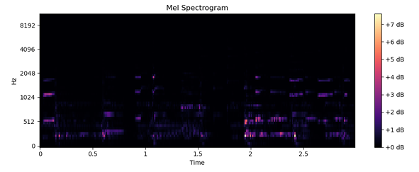
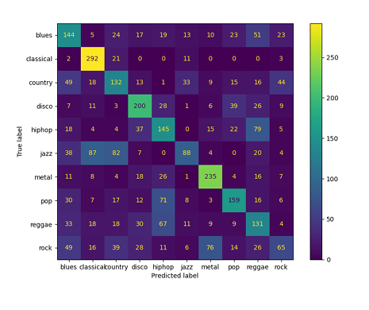

<h1 style="text-align:center">
    Music Genre Classification Using a Convolutional Neural Network
</h1>

## Introduction

Music genre classification is determining the genre of a song by extracting features from it to learn genre-specific features. It is used by streaming services to create song suggestions based on user preferences. In this project classification is tackled by training a convolutional neural network model to learn genre-specific features and classify songs based on those features.

The project is based on a [paper](https://arxiv.org/abs/1802.09697) by Migwen Don.

## Data 

The genre classification is performed on an open-source dataset [GTZAN](https://www.kaggle.com/datasets/andradaolteanu/gtzan-dataset-music-genre-classification)

The dataset consists of 1000 song samples from 10 different music genres. The samples are divided in a way that for each of 10 genres there are 100 samples. For classification purposes the audio samples are divided into training, validation and testing samples. Each sample is converted from timescale to frequency scale, in the form of a Mel-spectrogram with 64 Mel bins. The spectrograms are then split into 3-second-long segments. The segments are then used for the genre classification.

  

 The used song samples are divided using split of 50% training, 20% validation and 30% 
testing. 

Note:

File jazz.00054.wav is faulty. Replaced it with a copy of jazz.00053.wav.  

### Performance

The model reached 48% accuracy with the classification, which is poorer than the human-like classification accuracy reached in the source paper. The resulting confusion matrix of the predicted genres can be seen below.

  

### Further development

The accuracy of the model could be improved by:
- Further tuning the parameters and hyperparameters of the model
- Using different sizes for fixed lengths of audio
- Using regularization for the CNN
- Gathering more data
